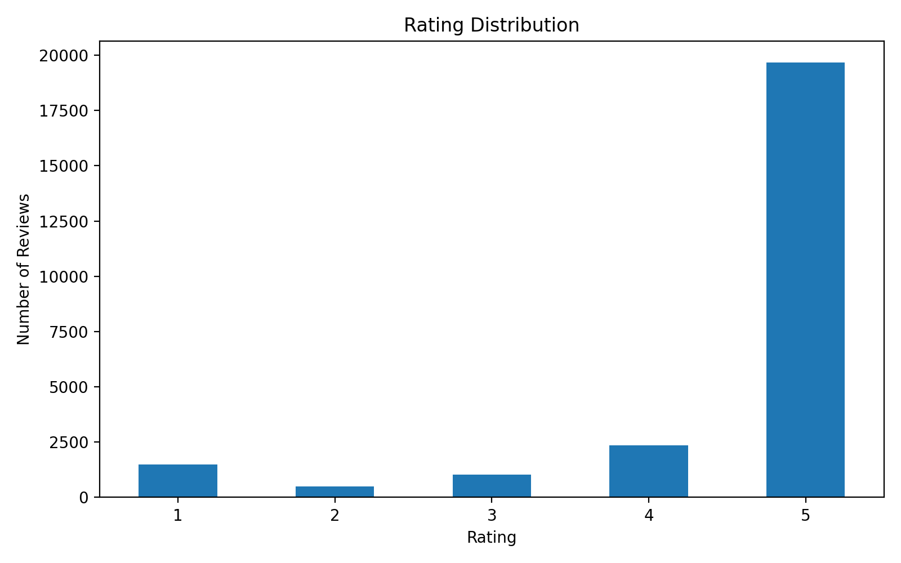
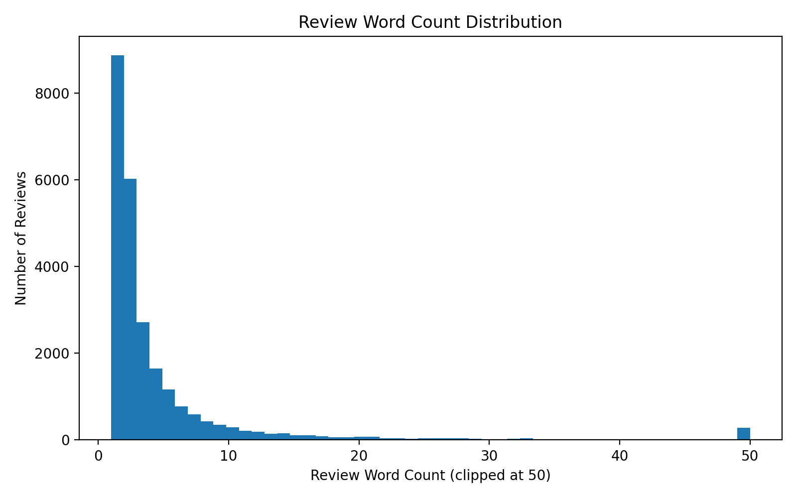
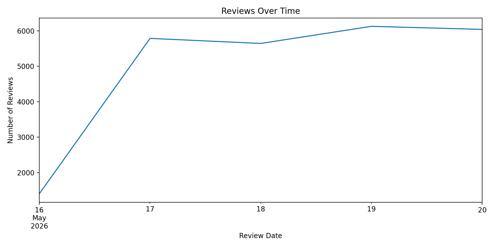
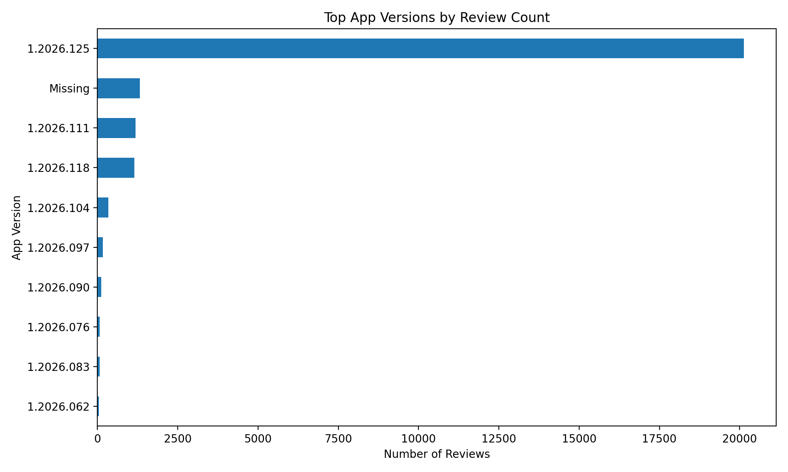

# Google Play ChatGPT 10k Review Collection Summary

## Collection Setup

- Source: Google Play Store
- App: ChatGPT
- App ID: `com.openai.chatgpt`
- Country: `us`
- Language: `en`
- Reviews requested: 25000
- Reviews collected: 25000
- Runtime: 12.23 seconds
- Output file: `data/raw/google_play_chatgpt_25k.csv`

## Date Range

- Earliest review date in sample: 2026-05-16 14:06:20
- Latest review date in sample: 2026-05-20 19:44:33

## Rating Distribution

|    |   rating |
|---:|---------:|
|  1 |     1480 |
|  2 |      489 |
|  3 |     1020 |
|  4 |     2348 |
|  5 |    19663 |

## Missing Field Summary

|                    |   missing_count |   missing_percent |
|:-------------------|----------------:|------------------:|
| source_platform    |               0 |              0    |
| app_name           |               0 |              0    |
| app_id             |               0 |              0    |
| country            |               0 |              0    |
| language           |               0 |              0    |
| review_id          |               0 |              0    |
| review_text        |               0 |              0    |
| rating             |               0 |              0    |
| review_date        |               0 |              0    |
| app_version        |            1327 |              5.31 |
| thumbs_up_count    |               0 |              0    |
| developer_response |           25000 |            100    |
| collected_at       |               0 |              0    |
| review_text_clean  |               0 |              0    |
| review_char_length |               0 |              0    |
| review_word_count  |               0 |              0    |
| is_very_short      |               0 |              0    |
| is_generic_text    |               0 |              0    |
| is_low_signal      |               0 |              0    |

## Review Length Summary

|       |   review_char_length |   review_word_count |
|:------|---------------------:|--------------------:|
| count |             25000    |            25000    |
| mean  |                23.69 |                4.7  |
| std   |                51.58 |                9.49 |
| min   |                 1    |                1    |
| 25%   |                 5    |                1    |
| 50%   |                 9    |                2    |
| 75%   |                20    |                4    |
| max   |               500    |              182    |

## Duplicate / Low-Signal Checks

- Duplicate review text count: 12131
- Low-signal review count: 14900 (59.6%)

## Top App Versions

|            |   app_version |
|:-----------|--------------:|
| 1.2026.125 |         20131 |
|            |          1327 |
| 1.2026.111 |          1191 |
| 1.2026.118 |          1153 |
| 1.2026.104 |           345 |
| 1.2026.097 |           167 |
| 1.2026.090 |           113 |
| 1.2026.076 |            70 |
| 1.2026.083 |            67 |
| 1.2026.062 |            50 |

## Figures and Initial Interpretation

### Rating Distribution

The rating distribution is heavily skewed toward 5-star reviews. Out of 25,000 collected reviews, 19,659 are 5-star reviews, while lower ratings are much less frequent. This suggests a positive-rating imbalance, which should be considered before rating as sentiment lables or training downstream models. 

### Review Word Count Distribution

The review length distribution is highly cnocentrated at very short reviews. The median word count is 2, and many reviews contain only one or two words such as "good" or "great". So this suggests that a large amount of low-singal content that may be less useful for detailed topic or pain-point analysis. 

### Reviews Over Time

The collected reviews are concentrated over a short recent time window. Most review appear between May 16 and May 20, 2026. This suggests that the current collection captures recent feedback rather than a long historical sample, which is useful for live monitoring but may not fully represent longer-tmer sentiment trends.

### Top App Versions by Review Count

Most reviews are associated with app version `1.2026.125`, while 1,327 reviews have missing app version values. This suggests that app version is mostly available but incomplete. Downstream analysis can use app version as useful metadata, but should handle missing values explicitly.

## Initial Notes

- This is a first-pass exploratory analysis of Google Play reviews for ChatGPT.
- The dataset should be further checked for multilingual content, repeated text, very short reviews, emoji-heavy reviews, and other user-generated-content noise.

